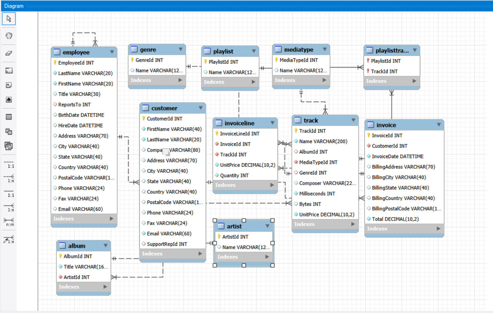
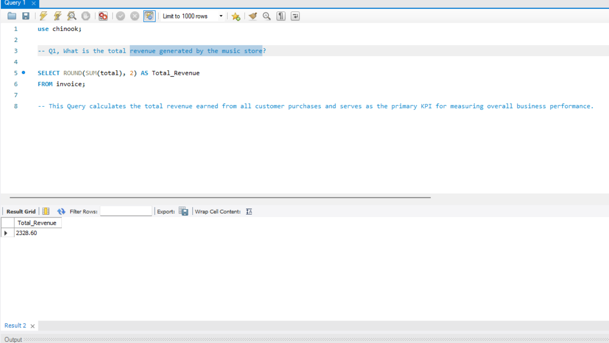

# 🎵 Music Store SQL Analysis


# 📌 Project Overview

This project analyzes the **Music Store Database** using **MySQL** to solve real-world business problems through SQL.

The project focuses on extracting actionable business insights related to:

- Sales Performance
- Customer Analysis
- Employee Performance
- Music Trends
- Geographic Analysis

The objective is to demonstrate practical SQL skills used by Data Analysts in solving business problems.

---

# 🎯 Project Objectives

- Analyze customer purchasing behavior
- Identify top-performing artists and tracks
- Measure revenue across countries
- Evaluate employee performance
- Discover music genre trends
- Generate business insights using SQL

---

# 🛠 Tools Used

- MySQL
- MySQL Workbench
- SQL
- Git
- GitHub

---

# 🗄 Database Schema



---

# 📂 Database Tables

| Table | Description |
|---------|-------------|
| Artist | Artist information |
| Album | Album details |
| Track | Music tracks |
| Genre | Music genres |
| MediaType | Media formats |
| Playlist | Playlist information |
| PlaylistTrack | Playlist tracks |
| Customer | Customer information |
| Employee | Employee information |
| Invoice | Customer invoices |
| InvoiceLine | Purchased tracks |

---

# 📈 Business Problems Solved

## 1️⃣ Total Revenue Generated

### Business Question

What is the total revenue generated by the company?

### Finding

Calculated the overall revenue generated from all customer purchases.



---

## 2️⃣ Average Order Value

### Business Question

What is the average amount spent per order?

### Finding

Calculated the average value of each invoice to understand customer spending behavior.


---

## 3️⃣ Total Customers

### Business Question

How many customers does the music store have?

### Finding

Determined the size of the customer base.


---

## 4️⃣ Top 10 Customers by Revenue

### Business Question

Which customers contribute the highest revenue?

### Finding

Identified the highest-value customers for potential loyalty programs.


---

## 5️⃣ Revenue by Country

### Business Question

Which countries generate the highest revenue?

### Finding

Compared total sales across countries to identify top-performing markets.


---

## 6️⃣ Customers by Country

### Business Question

Which countries have the highest number of customers?

### Finding

Analyzed customer distribution across different countries.


---

## 7️⃣ Best Selling Artists

### Business Question

Which artists generate the highest revenue?

### Finding

Identified artists contributing the most revenue to the business.


---

## 8️⃣ Most Popular Genres

### Business Question

Which genres are purchased the most?

### Finding

Determined customer music preferences by analyzing genre popularity.


---

## 9️⃣ Top Selling Tracks

### Business Question

Which tracks are purchased most frequently?

### Finding

Identified the best-performing songs in terms of sales volume.


---

## 🔟 Monthly Revenue Trend

### Business Question

How has revenue changed over time?

### Finding

Analyzed monthly sales trends to identify growth patterns and seasonality.


---

## 1️⃣1️⃣ Employee Sales Performance

### Business Question

Which employee generated the highest revenue?

### Finding

Compared employee performance based on sales generated from their assigned customers.


---

# 💡 Key Insights

- Revenue is concentrated among a relatively small group of customers.
- Some countries contribute significantly more revenue than others.
- A few artists account for a large share of music sales.
- Customer preferences are concentrated around specific genres.
- Monthly sales trends can support forecasting and promotional planning.
- Employee performance differs based on the revenue generated by their customer portfolios.

---

# 🧠 SQL Skills Demonstrated

✔ SELECT

✔ WHERE

✔ ORDER BY

✔ GROUP BY

✔ HAVING

✔ LIMIT

✔ Aggregate Functions

✔ INNER JOIN

✔ Multi-table Joins

✔ Aliases

✔ Date Functions

✔ String Functions

---

# 📁 Project Structure

```
Chinook-Music-Store-SQL-Analysis
│
├── Dataset
│   └── Chinook_MySql.sql
│
├── SQL Queries
│   ├── 01_Total_Revenue.sql
│   ├── 02_Average_Order_Value.sql
│   ├── ...
│
├── Images
│   ├── banner.png
│   ├── ER_Diagram.png
│   ├── 01_Total_Revenue.png
│   ├── ...
│
└── README.md
```

---

# 🚀 Future Enhancements

- Solve 30+ business problems
- Add Common Table Expressions (CTEs)
- Use Window Functions
- Create Views and Stored Procedures
- Build an interactive Power BI dashboard
- Develop an executive KPI dashboard

---

# 👨‍💻 About Me

**Kiran Bhardwaj**

📧 Data Analyst

🔗 **GitHub**

https://github.com/BhardwajKiran

🔗 **LinkedIn**

https://www.linkedin.com/in/kiran-bhardwaj-b34a29317/

---

## ⭐ If you found this project helpful, don't forget to star the repository!
